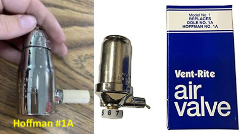
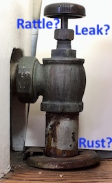

## TudorArms 

Some information for residents.   

*There's a problem with residents being responsible for this - they have to be motivated by the campaign.  Even if we don;t do them all, getting a lot of them will help.  Boiler water loss contributes to boiler wear and tear majorly, according to Gordon.  He's started me on my upper division boiler courses this semester.*

**Extend shut-off valve life and control your heat better**  
**Help extend our boiler life, saving you and TA money**

## How? Two ways...

### 1: Replace nose-cone style with new Vent Rites

*Names & URLs in captions, current web price*

*Point out possible plaster damp near valve (leaks happen at the top - detectable with a finger held just above it when steam's up)*

 *I can't see many residents doing this.  We could arrange a single plumber visit with cost sharing)*
#### Replacing these is best done when the heat isn't running (for safety's sake):   
- Close the radiator's shut off valve 
- Remove its cover if it has one 
- Unscrew the old valve 
- Screw in the new one (use pipe thread compound, or teflon tape, but keep it away from the opening) 
- If necessary, get a hole cut in the cover so you can turn the steam control dial in the regulator 
- Replace the radiator cover 
- Re-open the shutoff valve 

### 2: Be kind to your shut-off valve
Using the shut-off valve frequently wears it out.  It also loses water and steam if the packing nut comes loose.  This is easily fixed in minutes!  Is your plaster damp around it?

## Water loss reduces boiler life!

